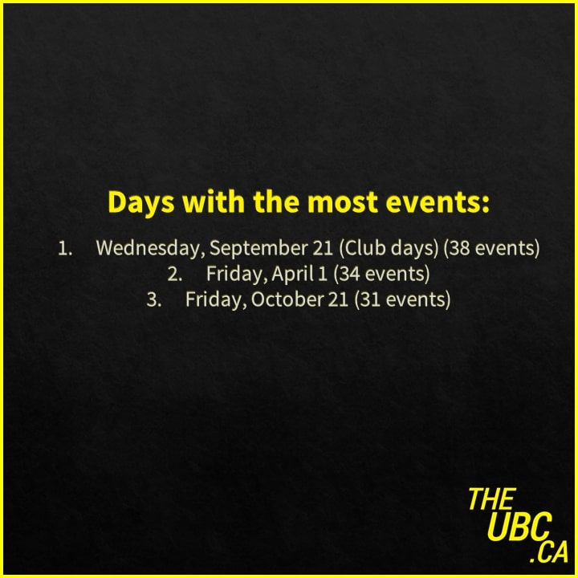

# theUBC.com

*An All-in-one event hub for everything happening at UBC. Designed a visually appealing and easy-to-use website that is independent and not-for-profit. The content to automatically collect data from over 450 Facebook pages and groups with relations to UBC. A brief annual statistical analysis of this data was published on the social media associated with this website.*

This is what’s happening on the “backend” of theUBC.ca:

This updater, goes through all the desired event data from Facebook Graph API and RSVPs to them so that they show up on Facebook’s calendar. So I just had to add that calendar to my WordPress website and let my calendar widget do the rest.

Note: I have to confess that this is not the best way to do this by any measure! I feel like having a WordPress front-end forced me to do not very pretty stuff to automate the backend. In retrospect, if I start over, I would write a more integrated stack from the start!

#### Screenshots

#### Data analysis

